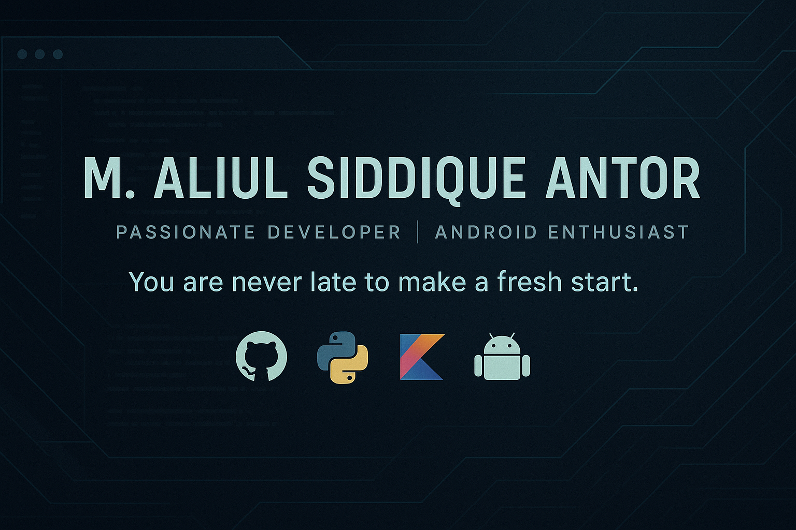

# 💫 About Me:
🔭 I’m currently working on MERN 👯 I’m looking to collaborate on full-stack web development 🤝 I’m looking for help with 🌱 I’m currently learning ML and Android app development with kotlin 💬 Ask me about anything ⚡ Fun fact : I like reading books and writing poems. I do have pets and they are Cokatiels.

<h3 align="left">Connect with me:</h3>

# 💻 Tech Stack:
                       

# 📊 GitHub Stats:
 
 

### 🔝 Top Contributed Repo

---

<picture>
  <source media="(prefers-color-scheme: dark)" srcset="https://raw.githubusercontent.com/Antor1971/Antor1971/output/github-snake-dark.svg" />
  <source media="(prefers-color-scheme: light)" srcset="https://raw.githubusercontent.com/Antor1971/Antor1971/output/github-snake.svg" />
  
</picture>
